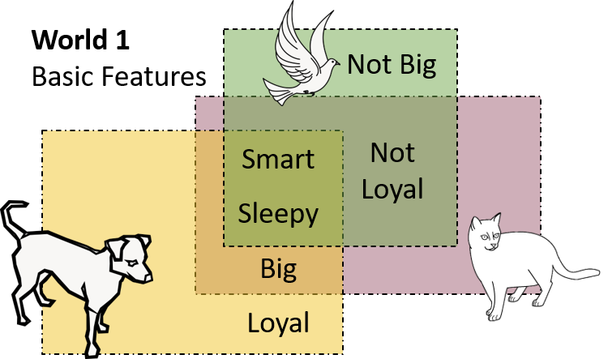
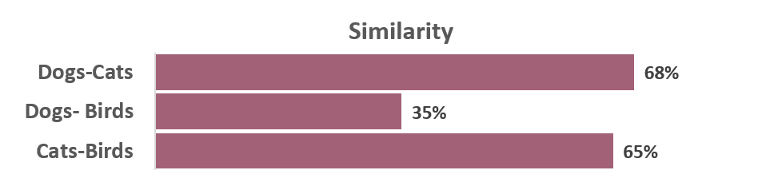
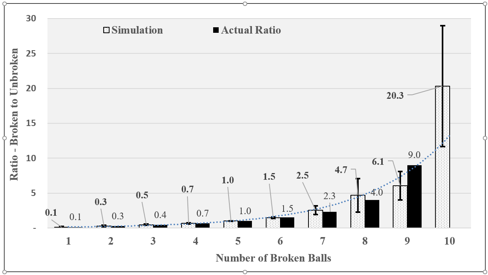
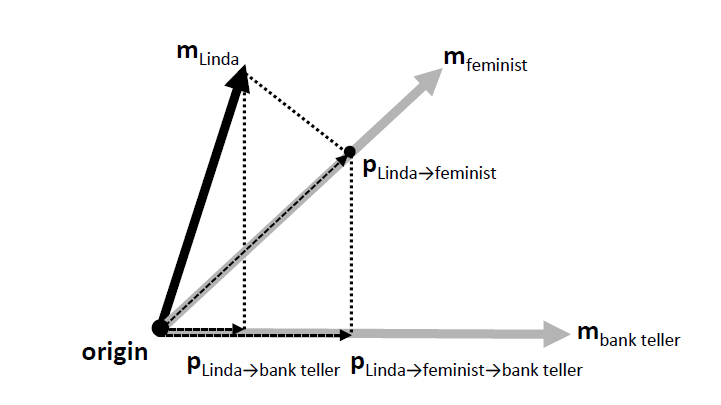
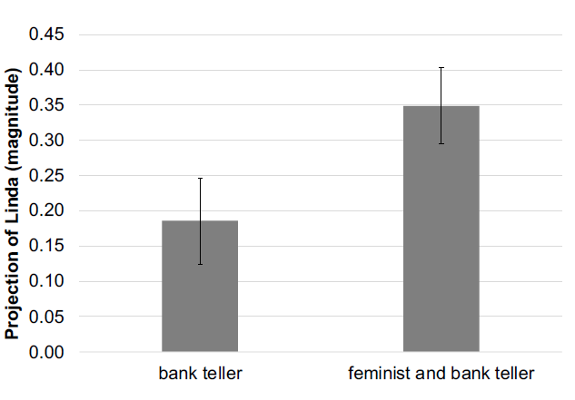

# Kantian-Holographic Declarative Memory (K-HDM)

For detailed description, refer to Arora et al., 2018 [1][2]
Vector Symbolic Architectures (VSAs) are a family of connectionist architectures specifically developed to create systems for symbol instantiation and manipulation (for a detailed review refer to [3]). VSAs operate via algebraic operations on distributed representations over a high-dimensional vector space. The exact choice of vector operations varies from model to model, but what is common across VSAs is that things are represented by a vector defined by a set of randomly generated. Relationships are stored by moving the corresponding vectors through a single high-dimensional space in which they are instantiated.

Rutledge-Taylor et al.[4]  introduce cardinal vectors as innate atomic items and K-HDM introduces Kantian categories as innate vectors to encode all conceptual relationships. K-HDM represents concepts through two vectors—environmental and memory. An environmental vector (Ec) represents the percept of the concept (C), and can be understood as its referent. A memory vector (Mc) encodes C’s relationship with other concepts. A concept has meaning as a result of these relationships, and thus Mc can be understood as the sense of the concept. Unlike concepts, the cardinal categories do not undergo a change in meaning as more knowledge is gathered. Thus, they will have one environment vector and no memory vector. K-HDM stores all xRy relationships as new concepts with their own pairs of vectors. So, some doors are red (let's call it concept P1) gets stored as a new concept. In this form, it is no longer a proposition, but a complex concept some red doors.

Simulations run on Kantian-HDM replicate psychological behavior (like the fan-effect [5],[4]) as well some other interesting effects courtesy the addition of Kantian categories. For example, K-HDM allows for the analogical reasoning of the kind ‘A is B as C is to ?’. Widdows and Cohen [6] deploy something akin to the hypothetical Kantian category in their vector system to get similar results for analogical reasoning. In what follows, we will focus on the unique results obtained in K-HDM regrading quantitative estimates.

## Basic Memory Storage and Similarity
Like the conventional word-embedding models, K-HDM is able to store relations that concepts have with each other and reflect it in terms of similarity differences between concepts. The figure on the left shows similarity between concepts of dog, cat, birds, averaged over 20 simulations based of storage of relationships shown in figure on right.

## Numerical Cognition and estimating ratios
K-HDM model replicates numerical cognition phenomenon where approximate ratios can be derived from memory without explicit storage of some of the quantity information. Below are results from the simulations which encodes instances of broken balls and unbroken balls, and then uses ratio of projection of vector for the concept of Ball to that of Broken and Unbroken to estimate actual algebraic ratios. 

## Conjunction Fallacy
Famously, Tversky and Kahneman (1983)[7] showed that human reasoning around probability often violates the conjunction rule. In an experiment, Tversky and Kahneman presented participants with a story about a hypothetical person, Linda, whose characteristics aligned her towards certain interests (like feminism) more than others (like financial systems), such that:
P(Linda is a bank teller) < P(Linda is a feminist). 

Participants were then asked to evaluate the probability of various statements about Linda. The critical comparison concerned the probability estimates of statements “Linda is a bank teller” and “Linda is a bank teller and a feminist.” Most participants judged the latter as more probable than the former, implying that for them:

P(Linda is a bank teller) < P(Linda is a bank teller ^ Linda is a feminist)

Tversky and Kahneman’s experiment illustrates the conjunction fallacy, the belief that a conjunction is more probable than the constituent events. While the conjunction fallacy is not compatible with the classical probability theory, Busemeyer et al., 2011 [8]
argue that the fallacy is explicable through quantum probability theory. K-HDM successfully simulates this phenomenon because its geometric operations naturally implement quantum probability and replicate the results from Tversky’s experiment.

Bibliography
[1]	N. Arora, R. West, A. Brook, and M. Kelly, “Why the Common Model of the mind needs holographic a-priori categories,” Procedia Comput. Sci., vol. 145, pp. 680–690, Jan. 2018, doi: 10.1016/J.PROCS.2018.11.060.
[2]	N. Arora, “Modeling Meaning a Kantian Intervention in Vector Space Semantics,” Carleton University, 2018.
[3]	J. Mitchell and M. Lapata, “Vector-based Models of Semantic Composition.,” Acl, vol. 8, no. June, pp. 236–244, 2008.
[4]	M. F. Rutledge-Taylor, M. A. Kelly, R. L. West, and A. A. Pyke, “Dynamically structured holographic memory,” Biol. Inspired Cogn. Archit., vol. 9, pp. 9–32, 2014, doi: 10.1016/j.bica.2014.06.001.
[5]	M. A. Kelly, K. Kwok, and R. L. West, “Holographic Declarative Memory and the Fan Effect: A Test Case for A New Memory Module for ACT-R,” in International Conference on Cognitive Modeling (ICCM), 2015, pp. 148–153.
[6]	D. Widdows, T. Cohen, M. Bing, and T. Cohen, “Reasoning with vectors: A continuous model for fast robust inference,” Log. J. IGPL, vol. 23, no. 2, pp. 141–173, 2014, doi: 10.1093/jigpal/jzu028.
[7]	A. Tversky and D. Kahneman, “Extensional versus intuitive reasoning: The conjunction fallacy in probability judgment.,” Psychol. Rev., vol. 90, no. 4, p. 293, 1983.
[8]	J. R. Busemeyer, E. M. Pothos, R. Franco, and J. Trueblood, “A quantum theoretical explanation for probability judgement errors,” Psychol. Rev., vol. 118, pp. 193–218, 2011, doi: 10.1037/a0022542.

